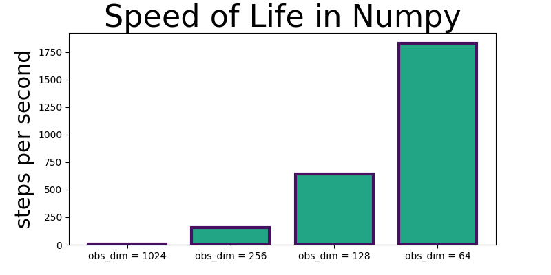
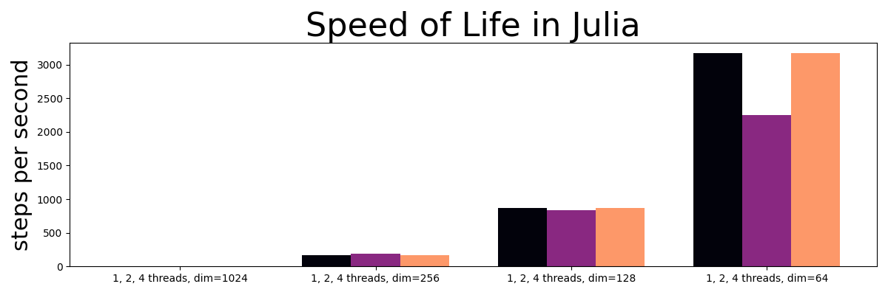
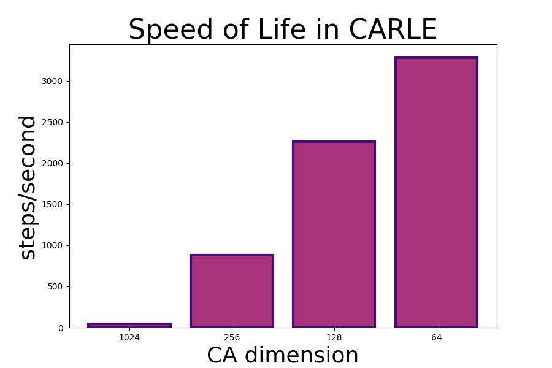

# Conway's Game of Life in Julia, Speed Test

## Conway's Game of Life in Julia, NumPy, and PyTorch, execution speeds compared.

### Results

| grid dimensions | Julia (1 thread)  | Julia (2 threads)  | Julia (4 threads)  |  NumPy  | CARLE       | units        |
|:---------------:|:-----------------:|:------------------:|:------------------:|:-------:|:-----------:|:------------:|
| 1024 by 1024    | 5.65              | _7.61_             | 7.37               | 5.56    | **46.48**   | steps/second |
| 256 by 256      | 162.33            | _197.34_           | 201.67             | 157.21  | **877.69**  | steps/second |
| 128 by 128      | _882.73_          | 873.14             | 854.00             | 641.38  | **2259.33** | steps/second |
| 64 by 64        | _**3292.31**_     | 2372.21            | 1966.58            | 1831.78 | 3280.93     | steps/second |

Table of execution speeds on a 4-core Intel i5-6300U laptop CPU 

 
Glider in Conway's Life used to test simulation performance in Julia and PyTorch

 

After fixing a few things in my Julia implementation and upgrading to Python 1.9.0, 
Don't get me wrong, I know that I could almost certainly speed up my Julia implementation to approach the performance I saw with CARLE, my PyTorch baseline. I look forward to finding both low-hanging fruit and hidden tricks for speeding up cellular automata as I get more familiar with the Julia language. But for now, this current Julia language implementation simulating Life-like cellular automata ranges from about 20% to 20X slower than in the PyTorch implementation, depending on parameters. 

In CARLE I used PyTorch's built in convolutions and in Julia I used Fourier transform-based convolutions with `FFTW.jl`. Although `FFTW.jl` has the option to control the number of threads used with `FFTW.set_num_threads`, utilization was never much more than 4 threads and performance actually decreased when set to use more threads in most circumstances. For a more direct comparison, I also implemented Conway's Life using Fourier transform convolutions in NumPy, which ended up being the slowest implementation. 

 
CA (Conway's Life) simulation performance with Python+NumPy on a 4-core Intel i5-6300U laptop CPU.

 
CA (Conway's Life) simulation performance with Julia and FFTW.jl on a 4-core Intel i5-6300U laptop CPU.

 
CA (Conway's Life) simulation performance with Python+PyTorch (<a href="https://github.com/rivesunder/carle">CARLE</a>) on a 4-core Intel i5-6300U CPU.

### Results from first implementation

Previously I compared Life execution speeds in Julia to CARLE, but I've updated both implementations (and made an additional implementation in NumPy) and the results are now much more comparable than they were before. The main problem I fixed in my Julia implementation was an extra FFT computation that wasn't used anywhere. Uurprisingly removing this line improved Julia speeds by about 100%. I also updated my PyTorch installation to 1.9.0 and moved the benchmarking code into scripts instead of relying on Jupyter Notebooks, which were giving me inconsistent results. In any case here are the earlier results:

 
CA (Conway's Life) simulation performance with Julia on a 4-core Intel i5-6300U CPU.

 

 
CA (Conway's Life) simulation performance with Python+PyTorch (<a href="https://github.com/rivesunder/carle">CARLE</a>) on a 4-core Intel i5-6300U CPU.

 

 
CA (Conway's Life) simulation performance with Julia on a 24-core AMD Threadripper 3960x CPU.
 

 
CA (Conway's Life) simulation performance with Python+PyTorch (<a href="https://github.com/rivesunder/carle">CARLE</a>) on a 24-core AMD Threadripper 3960x CPU.

 
