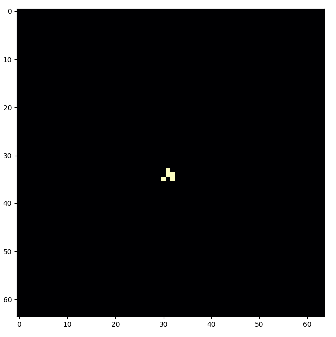
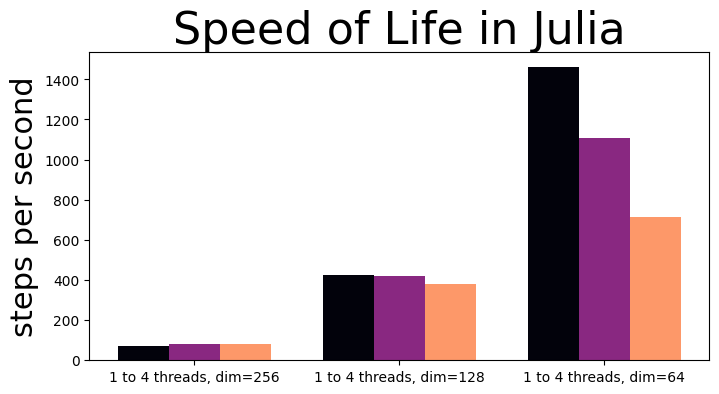
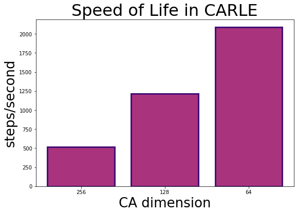
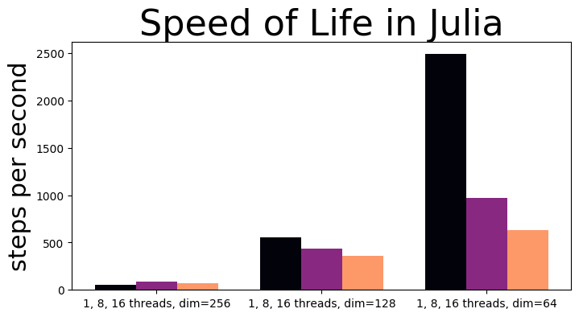
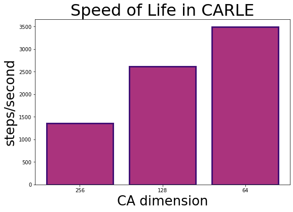

# Conway's Game of Life in Julia, Speed Test

## The Development Speed of Python with (Half) the Execution Speed of ... Python (w/ PyTorch)

 
Glider in Conway's Life used to test simulation performance in Julia and PyTorch

 

Don't get me wrong, I know that I could almost certainly speed up my Julia implementation to approach the performance I saw with CARLE, my PyTorch baseline. I look forward to finding both low-hanging fruit and hidden tricks for speeding up cellular automata as I get more familiar with the Julia language. But for now, this current Julia language implementation simulating Life-like cellular automata ranges from about 20% to 20X slower than in the PyTorch implementation, depending on parameters. 

 
CA (Conway's Life) simulation performance with Julia on a 4-core Intel i5-6300U CPU.

 

 

CA (Conway's Life) simulation performance with Python+PyTorch ([CARLE](https://github.com/rivesunder/carle)) on a 4-core Intel i5-6300U CPU.
 

 
CA (Conway's Life) simulation performance with Julia on a 24-core AMD Threadripper 3960x CPU.

 

CA (Conway's Life) simulation performance with Python+PyTorch ([CARLE](https://github.com/rivesunder/carle)) on a 24-core AMD Threadripper 3960x CPU.
 

In CALRE I used PyTorch's built in convolutions and in Julia I used Fourier transform-based convolutions with `FFTW.jl`. Although `FFTW.jl` has the option to control the number of threads used with `FFTW.set_num_threads`, utilization was never much more than 4 threads and performance actually decreased when set to use more threads in most circumstances. 
